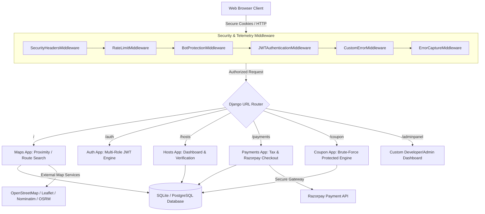

# 🗺️ WebMaps — Next-Gen Location-Based Service SaaS Platform

[](https://djangoproject.com)
[](https://leafletjs.com)
[](https://jwt.io)
[](https://razorpay.com)
[](#-advanced-hacker-protection--security-stack)

WebMaps is a highly-optimized, location-intelligent, and secure Software-as-a-Service (SaaS) directory platform. It connects customers searching for specialized local business services (such as premium auto detailing, ceramic coating, custom wraps, etc.) with verified business hosts. 

Unlike conventional directories, WebMaps is built around an **interactive geographic canvas** utilizing OpenStreetMap and Leaflet, and features **advanced route-based proximity searching** along path networks.

---

## 🏛️ System Architecture Overview

The system is decoupled into specific, modular Django application domains interacting with a secure middleware layer, relational models, caching interfaces, and external API services (Razorpay, OpenStreetMap, Nominatim, and OSRM).



---

## 🛠️ Key Product Features & Core Use Cases

### 1. 👥 Customer Features
*   **Geographic Discovery:** Find active, approved business listings in real-time on a beautiful Leaflet-powered visual map canvas. Filter markers dynamically based on distances, business categories, or rating thresholds.
*   **Elite Proximity Search:** Highly responsive searching within a configurable radius of any point, supported by double-tier coordinate indexing.
*   **"X to Y" Route-Based Proximity Search:** Search for services *along a scheduled travel route* (e.g. from Delhi to Noida). The platform evaluates listing proximities relative to the transit polyline.
*   **Advanced Review & Feedback Loop:** Write, edit, and moderate star ratings (1 to 5) and textual reviews, complete with anti-double-posting guards.

### 2. 💼 Host & Merchant Features
*   **SaaS Dashboard:** A localized console to review active listings, view metrics, track subscription validity, and check active service configurations.
*   **Dynamic Operations & Map Visibility:**
    *   Add website links, contact numbers, short descriptions, geolocated coordinates, and weekly operating hours (JSON-structured).
    *   **Map Toggle with Cooldown:** Hide or show listings on the public map at will. To prevent API spamming or server load spikes, a strict **8-hour cooldown** is programmatically enforced.
*   **Automated Service Sheet Parser:** Upload price menus or service checklists (`.txt`, `.csv`, `.pdf` formats supported). The system validates files against threat vectors and parses them directly into relational DB models via bulk-create execution.
*   **Subscription Trials:** Approved listings are automatically granted a **3-day premium trial period** with fully unrestricted map visibility.

### 3. 👑 Developer & Platform Admin Features (`adminpanel`)
*   **Modern Analytics Dashboard:** Visual graphs and metrics tracking unique visits, total sessions, active plans, active/pending listings, and host growth.
*   **Verification Workflow:** Interactive listing review console. Admins can approve or reject submissions, with required text explanations automatically pushed to the host.
*   **Central Promo Engine:** Create, schedule, toggle, and audit active promotional coupons.
*   **Live App Telemetry & Log Monitoring:** Self-healing, real-time error logs page. Shows full-stack tracebacks, paths, and active occurrences directly from the database, bypassing the need to check server console log files.

---

## 🔒 Advanced Hacker Protection & Security Stack

WebMaps was engineered from the ground up to address critical security vectors. It contains a highly customized stack of automated defensive middlewares and models:

### 1. 🛑 Sliding-Window IP Rate Limiter (`RateLimitMiddleware`)
Protects key system endpoints against automated scripts and brute-force flooding.
*   **Login Endpoint Limit:** Max 5 requests/minute.
*   **Register Endpoint Limit:** Max 3 requests/minute.
*   **Global APIs Endpoint Limit:** Max 100 requests/minute.
*   *Action:* Exceeded requests automatically receive an HTTP `429 Too Many Requests` response, rendering a high-end error dashboard (or secure JSON for AJAX).

### 2. ⚡ Coupon Brute-Force Defence (3-Strike Account Lockout)
Protects against automated promotional code scanners.
*   Users are allowed up to **3 consecutive failed coupon validation attempts**.
*   On the third strike, the system locks the user's coupon privileges for **7 hours** (`CouponAttempt.blocked_until`).
*   Any attempt during the lock throws an HTTP `403 Forbidden` response displaying a dynamic countdown (e.g., *"Blocked for 6 hours 42 minutes"*).
*   A successful coupon validation automatically resets the failed strikes to zero.

### 3. 🤖 Automated Bot & Vulnerability Scanner Blocker (`BotProtectionMiddleware`)
Scans request headers for common bad bots, automated crawlers, and offensive scanning tools.
*   **Monitored Scanners:** `sqlmap`, `nikto`, `nmap`, `masscan`, `zgrab`, `curl`, `wget`, `python-requests`, `scrapy`, `ahrefsbot`, `semrushbot`, etc.
*   *Action:* Instantly terminates request pipeline execution with an HTTP `403 Forbidden` response.

### 4. 🔑 Multi-Role Double JWT Cookie Token Stack
Replaces default session authorization or readable Javascript LocalStorage mechanisms.
*   **HTTPOnly & Secure Delivery:** Access and refresh tokens (`access_token`, `refresh_token`) are delivered inside securely cryptographed HTTPOnly, Secure, SameSite=Lax cookies.
*   **XSS Mitigation:** JavaScript is entirely barred from reading or extracting the credentials, rendering standard cookie-theft XSS attempts useless.
*   **Automatic Blacklisting & Rotation:** Old refresh tokens are blacklisted immediately upon token rotation and on account logout (`rest_framework_simplejwt.token_blacklist`).

### 5. 📧 Email Enumeration Defeated
*   The Password Reset module returns a standard message (*"If that email is registered, a reset link has been sent."*) regardless of whether the queried email exists. Attackers cannot crawl this endpoint to construct active lists of registered users.

### 6. 🛡️ Hardened Security Response Headers (`SecurityHeadersMiddleware`)
Injects high-grade security flags on every response to control client-side browser behavior:
*   `X-Content-Type-Options: nosniff` (Defeats MIME-sniffing exploits)
*   `X-Frame-Options: DENY` (Blocks framing, iframe manipulation, and clickjacking)
*   `X-XSS-Protection: 1; mode=block` (Enforces modern XSS filtering)
*   `Referrer-Policy: strict-origin-when-cross-origin` (Protects metadata exposure)
*   `Permissions-Policy: geolocation=(self)` (Limits hardware access vectors)
*   **Content Security Policy (CSP):** Restricts script, image, and style assets strictly to local origins and pre-authorized service platforms (`maps.googleapis.com`, `checkout.razorpay.com`, `unpkg.com`, `tile.openstreetmap.org`, `fonts.googleapis.com`).

### 7. 📁 Upload Integrity & Limits
*   Enforces a strict file-size cap of **5MB** (`FILE_UPLOAD_MAX_MEMORY_SIZE`).
*   Checks files against a strict extension whitelist (`.txt`, `.csv`, `.pdf`) and validates official MIME types, blocking binary-based malware masking.

### 8. 🚨 Technical Info Leakage Prevention (`CustomErrorMiddleware`)
*   When standard unhandled exceptions happen, the system intercepts the traceback and serves premium, themed static pages (404, 403, 500) *even when DEBUG=True*. Developers are spared from accidentally exposing sensitive system paths, databases, or environment properties to end users.

---

## 🔑 The Three-Mode Login & Registration Architecture

To manage distinct operations, the platform implements three isolated workflows:

### 1. 👥 Customer Login & Self-Registration
*   **Path:** `/auth/register/` and `/auth/login/`
*   **Target:** Local directory explorers.
*   **Permissions:** View listings, navigate routes, submit ratings, and modify personal reviews.
*   **Default Redirect:** `/` (Interactive Map Interface)

### 2. 💼 Host/Merchant Login & Registration
*   **Path:** `/auth/register/` (Selecting role "Host") and `/auth/login/`
*   **Target:** Store owners and detailers.
*   **Permissions:** Access the Host console, upload price lists, toggle visible markers, initiate Razorpay checkouts, and configure business cards.
*   **Default Redirect:** `/hosts/dashboard/` (Merchant Dashboard)

### 3. 🛠️ Secure Developer & Administrator Registration & Login
*   **Path:** `/auth/register/developer/` and `/auth/login/`
*   **Verification:** Requires entering a master cryptographical security key (`DEVELOPER_SECRET_KEY`, defaulting to `webmaps_admin_secure_2026`).
*   **Permissions:** Full administrative permissions. Directs to the `adminpanel` to manage reviews, users, coupon listings, visual telemetry statistics, and resolve app exceptions.
*   **Default Redirect:** `/adminpanel/` (Developer Command Center)

---

## 💳 High-End Pricing, GST Taxes, & Billing Calculations

SaaS transactions are processed via Razorpay. The platform maintains exact precision across GST and administrative charges:

### 1. Pricing Structure
*   **Base Cost:** Defined dynamically per Subscription Plan (e.g. ₹299, ₹999).
*   **Platform Fee:** Platform surcharge defined per plan (default: ₹50).
*   **Listing Update Surcharges:**
    *   Hosts receive **2 listing updates for free**.
    *   Updates thereafter trigger an update surcharge of **₹22.88** (excluding taxes), which totals exactly **₹29.00** once GST and Platform fees are processed.
    *   This ensures the platform monetizes continuous location/content updates.

### 2. The Tax & Fee Pipeline
The payment engine executes calculations using Python's precise decimal math to avoid rounding mistakes:

$$\text{Taxable Subtotal} = \text{Base Plan Cost} + \text{Update Surcharge (₹22.88 if updates} \ge 2\text{)}$$
$$\text{CGST (9\%)} = \text{Taxable Subtotal} \times 0.09$$
$$\text{SGST (9\%)} = \text{Taxable Subtotal} \times 0.09$$
$$\text{Platform Fee Extra} = \text{₹2.00}$$
$$\text{Final Total Payment (INR)} = \text{Taxable Subtotal} + \text{CGST} + \text{SGST} + \text{Platform Fee Extra}$$

### 3. 🏷️ Zero-Amount Checkout Gateway
*   If a host applies a 100% discount coupon (percentage-based or fixed value) that covers the entire plan or update surcharge, the system triggers a **Zero-Amount Free Bypass**.
*   Instead of making a request to Razorpay, the backend generates a safe transaction key prefixed with `FREE_` and activates the subscription or processes the update instantly, providing a seamless user experience.

---

## 📂 Repository Architecture

```text
WebMaps/
├── WebMaps/                 # Root Django configuration directory
│   ├── settings.py          # Production-hardened settings (Argon2, CSRF, JWT, CSP, DB)
│   └── urls.py              # Centralized route controllers & sitemap handlers
├── adminpanel/              # Administrative Dashboard, verification, and telemetry
├── analytics/               # Batched event engine (clicks, views, time trackers)
├── auth_app/                # Secure JWT cookie authenticator & credential validators
├── coupon/                  # Coupon models, 3-strike brute-force lock, notifications
├── errors/                  # Custom exception logs database & premium static responses
├── hosts/                   # Listing models, coordinate validations, document parser
├── logs/                    # Rotating system execution log files (webmaps.log, errors.log)
├── maps/                    # Leaflet coordinate maps, haversine algorithms, route filters
├── middleware/              # Custom defensive stack (CSP, Rate limits, Bot protection)
├── notifications/           # In-app alerts, sub validity alerts, and mail push
├── payments/                # Razorpay API controllers, CGST/SGST models, and billing
├── users/                   # Custom User model (UUID based, roles schema)
├── utils/                   # Sanitizers, secure ip hashing, sitemap templates
├── templates/               # Global templates (maps, hosts, admin, errors, auth)
├── static/                  # Shared style tokens, JS routers, map overlays
├── manage.py                # Django CLI controller
├── requirements.txt         # Hardened package requirements (Argon2-cffi, simplejwt, bleach)
└── README.md                # Project Blueprint & Developer Reference
```

---

## 🔍 Code Optimization & DB Performance Practices

To ensure sub-millisecond response rates, the repository implements strict optimization rules:
1.  **Fast Bounding-Box Indexing:** Before calculating heavy mathematical Haversine distances on geographic queries, the DB filters coordinates using a fast indexable bounding-box filter (`latitude__gte`, etc.). This limits processing to relevant listings.
2.  **Bulk Creation:** The Service Sheet Parser uses Django's `bulk_create` to insert service items into the database in a single SQL operation, rather than calling `.save()` on individual items, which reduces server loads.
3.  **Relational Fetching (Prefetch):** Complex geographic map listings prefetch relations (`prefetch_related('services', 'subscription')`), reducing potential $N+1$ database query bottlenecks.

---

## 📄 License

This project is licensed under the **MIT License**. See standard declarations for permissions.
